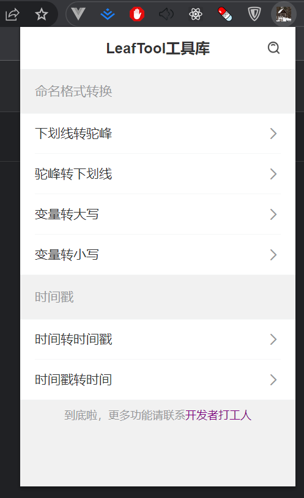

# leaf_tool_chrome_extensions

> 谷歌浏览器插件-LeafTool 工具库

# 使用方式

1. 下载仓库的`dist`文件夹至本地
2. 打开谷歌浏览器->扩展程序->管理扩展程序
3. 点击 加载已解压的扩展程序，选中`dist`文件夹加载即可

# 功能

- 命名格式转换
  - 下划线转驼峰
  - 驼峰转下划线
  - 变量转大写
  - 变量转小写
- 文本格式化
  - json 格式化
- 时间戳
  - 时间转时间戳
  - 时间戳转时间
